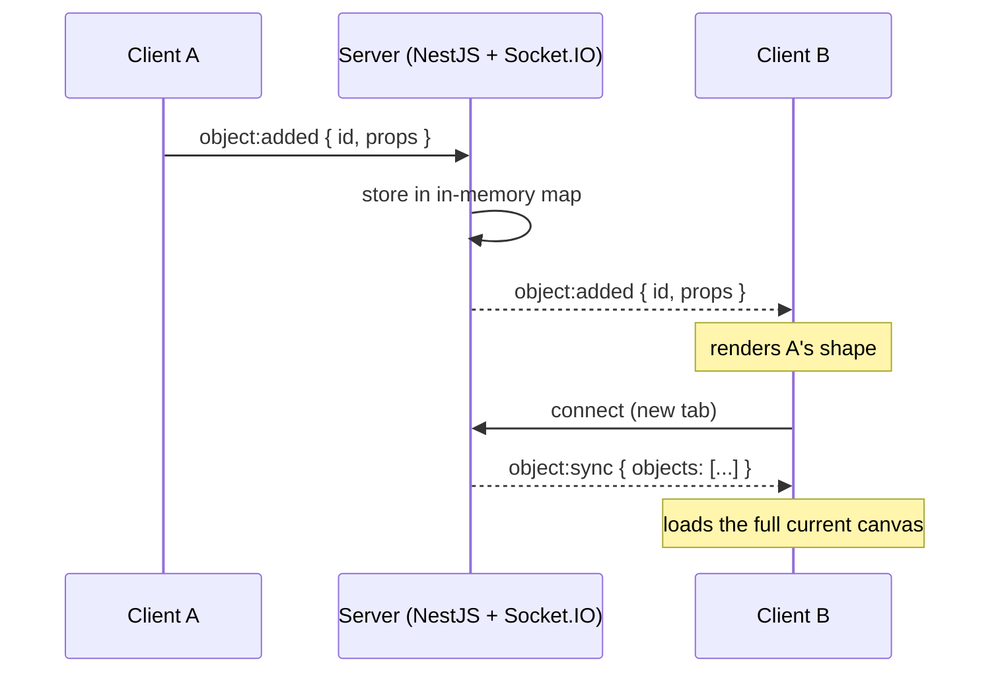

<div align="center">

# 🎨 WhiteBoard — *exclone*

**A real-time collaborative whiteboard.** Draw together on a shared canvas — every stroke, shape, and edit syncs to everyone instantly over WebSockets.

[](https://white-board-pearl-sigma.vercel.app)
&nbsp;


[**Live demo**](https://white-board-pearl-sigma.vercel.app) · [Frontend docs](./exclone-frontend/README.md) · [Backend docs](./exclone-server/README.md)

</div>

<!-- Add a screenshot or GIF of the board here:
      -->

---

## ✨ Features

- **Real-time collaboration** — open the board in two tabs (or on two devices) and watch every change appear instantly for everyone.
- **Drawing tools** — freehand pen (6 colors), highlighter, drag-to-erase eraser, plus rectangle / circle / text shapes.
- **Select & transform** — move, scale, rotate, and edit any object; double-click text to retype it.
- **Undo / redo** — full local history with `Ctrl/Cmd+Z` and `Ctrl/Cmd+Shift+Z`, rebroadcast so everyone stays in sync.
- **Late-join sync** — a new client instantly receives the entire current canvas, so it never starts blank.
- **Light / dark themes** — remembered across visits (and respects your system preference); the neutral pen adapts to the board.
- **Presence + connection status** — a "you" chip and a live/offline indicator driven by the socket connection.
- **Optional grid** and a **"clear board for everyone"** action.

---

## 🧱 Tech stack

| Layer | Technology |
|-------|-----------|
| **Frontend** | Next.js 14 (App Router), React 18, **Fabric.js 6** (canvas engine), `socket.io-client`, TypeScript |
| **Backend** | **NestJS**, **Socket.IO** (WebSocket gateway), TypeScript |
| **Realtime** | Socket.IO event protocol; server holds an in-memory, authoritative canvas state |
| **Deployment** | Frontend on Vercel |

This is a **monorepo** with two independent apps:

```
WhiteBoard/
├── exclone-frontend/   # Next.js + Fabric.js client  → see its README
└── exclone-server/     # NestJS + Socket.IO backend  → see its README
```

---

## 🏗️ How it works

The backend is the single source of truth. It keeps every object in an in-memory map (keyed by id), and re-broadcasts each change to **all clients except the sender** (the sender already drew it locally). New clients are caught up with a full `object:sync`.



**The echo-loop guard:** when a remote change is applied to the local canvas, Fabric would normally fire its own events and send the change straight back — looping forever. An `applyingRemote` flag wraps every server-driven update so those local events are ignored, keeping the two directions cleanly separated.

---

## 🚀 Getting started

Run the **backend first**, then the frontend.

### 1. Backend (`exclone-server`)

```bash
cd exclone-server
npm install
npm run start:dev          # http://localhost:3000  (REST + Socket.IO share this port)
```

Verify it's up:

```bash
curl http://localhost:3000/health     # {"status":"ok","uptime":...}
```

### 2. Frontend (`exclone-frontend`)

```bash
cd exclone-frontend
npm install
npm run dev                # Next picks a free port (accept 3001 if 3000 is taken)
```

Then **open the URL in two browser tabs** and draw in one — it appears in the other instantly.

> By default the frontend connects to `http://localhost:3000`. To point elsewhere, copy `.env.local.example` → `.env.local` and set `NEXT_PUBLIC_SERVER_URL`.

### Environment variables

| App | Variable | Default | Purpose |
|-----|----------|---------|---------|
| Frontend | `NEXT_PUBLIC_SERVER_URL` | `http://localhost:3000` | URL of the backend (Socket.IO + REST) |
| Backend | `PORT` | `3000` | Port the server listens on |

---

## 🔌 Realtime protocol

Every message uses the shape `{ id, props }`, where `props` is a Fabric object serialization.

| Event | Direction | Payload | Meaning |
|-------|-----------|---------|---------|
| `object:added`    | both | `{ id, props }` | A new object (shape, text, or stroke) was created |
| `object:modified` | both | `{ id, props }` | An object moved, scaled, rotated, or had its text edited |
| `object:removed`  | both | `{ id }` | An object was deleted or erased |
| `canvas:clear`    | both | *(none)* | The whole board was cleared |
| `object:sync`     | server → client | `{ objects: [...] }` | Full canvas state, sent to a newly connected client |

### REST endpoints (diagnostics)

| Method | Path | Description |
|--------|------|-------------|
| `GET` | `/` | Liveness string |
| `GET` | `/health` | `{ status, uptime }` |
| `GET` | `/event-log` | The last 100 logged events (circular buffer) |
| `DELETE` | `/event-log` | Clear the log buffer |

### Two-client integration demo

With the server running, in a second terminal:

```bash
cd exclone-server
node scripts/test-client.js
```

It connects two clients, has client A add/move/remove objects and clear the canvas, and prints what client B receives — proving the broadcast + sync flow end to end.

---

## 🧪 Tests

```bash
cd exclone-server
npm test                   # Jest unit tests for the gateway (add/modify/remove/clear/sync)
```

---

## 🛣️ Roadmap & known limitations

This is a focused, learning-oriented build. Deliberately left for a production version:

- **Persistence** — the canvas lives in memory and resets when the server restarts. Add a database (Postgres/Mongo) or Redis.
- **Multiple rooms** — everyone currently shares one board. Use Socket.IO rooms (`client.join(roomId)`) and key state by room.
- **Authentication** — CORS is open and there's no auth. Add a WebSocket guard / JWT.
- **Horizontal scaling** — in-memory state doesn't span instances. Use the Socket.IO Redis adapter + a shared store and sticky sessions.
- **Conflict handling** — concurrent edits to the same object are last-write-wins; CRDTs or operational transforms would resolve them cleanly.
- **Throughput** — batch/throttle rapid draw updates and send deltas instead of full objects.

---

## 🙏 Credits

Backend sync approach adapted from [this NestJS + Socket.IO whiteboard article](https://medium.com/@adredars/building-a-real-time-collaborative-whiteboard-backend-with-nestjs-and-socket-io-2229f7bf73bd), extended with the REST event log, tests, a live test client, and the full Fabric.js frontend (tools, undo/redo, theming, presence).

## 📄 License

[MIT](./LICENSE)
